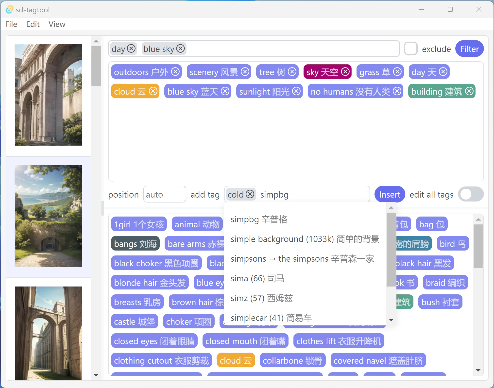

# sd-tagtool

这是一个简单的 stable diffusion 数据集标签编辑器。可用于编辑自动标签工具生成的数据集。这个工具受到了 [BooruDatasetTagManager](https://github.com/starik222/BooruDatasetTagManager) 的启发。

## 特性

- 支持所有图像标签的显示和管理
- 支持撤销/重做
- 标签输入智能提示（支持模糊匹配）
- 支持拖拽标签
- 可批量插入/删除标签，可指定插入位置
- 可通过标签过滤数据集
- 可自定义的标签高亮
- 自动翻译（现在写死了翻译到中文，并且可能需要魔法上网）
- 反应很快

## 截图


## 下载 / 安装

sd-tagtool 支持 Windows，macOS 和 Linux。安装步骤如下：
1. 在 [Release](https://github.com/skiars/sd-tagtool/releases) 页面找到最新的版本；
2. 依据操作系统从 **Assets** 列表中下载安装包文件，例如 Windows 安装包的后缀是 **_.msi_** 或者 **_.exe_**；
3. 运行安装文件。

**备注**：sd-tagtool 可能需要较新的 Windows 10 或者 Windows 11 才能运行。此外，我较少测试 Linux 和 MacOS 的兼容情况。

## 使用方法

基本的用法大家可以自己尝试，这里只补充几个细节。

### 基本的标签编辑

当你选中一个图片之后，拖拽图片的标签即可排序。点击标签上的 `×` 图标即可删除。不过当你选择了多张图片之后就不能再对标签进行排序了。

你还可以打开 *edit all tags* 开关，这样可以：
- 删除整个数据集中的标签（全部标签显示在窗口下方），例如删除全部标签中的 "1girl" 会导致所有图片中的 "1girl" 标签被删除；
- 插入或替换标签时会操作数据集的所有图片，而不只是选中的图片。

### 标签高亮

你可以在标签的的上下文菜单（点击鼠标右键）的 *Pick color* 为标签选择一个醒目的颜色，这样就可以快速找到它。当你不需要标签高亮时可以通过上下文菜单的 *Clear picked color* 来清除。

### 选择标签

在标签列表中用鼠标左键点击某个标签即可选择该标签。按住 `Ctrl` 键可以选择多个标签，按住 `Shift` 可以按范围选中多个标签。选中后的标签可以通过右键菜单来拷贝或者添加到过滤器。

### 标签过滤

在顶部的标签过滤栏中填写需要过滤的标签，然后点击 *Filter* 按钮即可过滤数据集。通过 *exclude* 复选框可以选择两种过滤模式：
- **包含模式**：图片具有过滤器中的所有标签时会在过滤后的列表中展示；
- **排除模式**：图片不具有过滤器中的所有标签时会在过滤后的列表中展示。

当你编辑了数据集之后，需要重新点击 *Filter* 按钮来更新过滤后的数据集。你可以手动输入标签，也可以在标签列表中点击鼠标右键并通过 *Add filter* 菜单将选中的标签添加到过滤器中。

### 插入标签

在标签编辑栏的输入框中输入标签然后点 *Insert* 按钮即可将新的标签插入到选中的数据集中（你可以选择多张图片）。如你所见标签输入框中可以填写多个 tag。

插入的位置由 *position* 输入框决定。目前支持 3 种模式：
- **auto**：如果图片中不存在要插入的标签就将该标签插到末尾，否则什么也不做；
- **正数**：把标签插入到从头部往后数的第几个位置，如果图片已经存在该标签则会将其移动到指定位置；
- **负数**：和正数类似，不过是从尾部往前数。

插入位置可以超出图片实际的标签数量，此时会将标签插到头部或尾部位置。

直接在全部标签列表中双击某个标签也会将其插入到选中图片的标签集中。此时的插入位置也是由 *position* 参数决定的。

### 替换标签

点击标签编辑栏左侧的 `>` 按钮可以打开标签替换栏。在 *replace with* 输入框中输入用于替换的标签，点击 *Replace* 按钮即可替换标签。标签的替换是一一对应的，例如：
- `a,b,c` 替换为 `d,e,f` 表示 `a` 替换为 `d`，`b` 替换为 `e`，`c` 替换为 `f`；
- `a,b,c` 替换为 `d,e` 表示 `a` 替换为 `d`，`b` 替换为 `e`，`f` 删除；
- `a,b` 替换为 `d,e,f` 表示 `a` 替换为 `d`，`b` 替换为 `e,f`。

每个标签的具体替换过程是：
- 替换后的标签会出现在原标签的位置；
- 如果替换后的标签已经存在于图片的标签列表中，会去除后面的重复项；
- 如果图片没有原标签则不执行对应的替换；
- 你还可以利用将标签替换为空来删除标签。

### 撤销 / 重做

点击 *Edit* 菜单中的 *Undo* 和 *Redo* 可以进行撤销和重做，还可以使用对应的快捷键来操作。

撤销和重做都没有步数限制，但是目前没有比较合理的交互反馈（这会导致你可能不知道发生了什么操作）。另外，打开新的目录之后会清除撤销历史记录。

### 翻译

点 *View* 的 *Translate tags* 菜单可以打开或关闭自动翻译。

### 删除孤立 txt 文件

当你删除了数据集文件夹中的图片文件之后，可以使用 *Tools* 菜单下的 *Delete isolated txt* 删除残留的 *\*.txt* 文件。该命令会弹出一个对话框让你确认需要删除的文件。

## 开发

本项目基于 [Tauri](https://tauri.app/) 和 [Vue.js](https://vuejs.org/) 开发。构建此项目需要先安装 Nojde.js 和 pnpm，在 Windows 上可以使用以下命令来安装：
``` bash
winget install nodejs # 安装 Node.js
winget install pnpm   # 安装 pnpm
```
然后参考此[文档](https://tauri.app/v1/guides/getting-started/prerequisites) 配置 Rust 工具链和 WebView2。如果你使用 Windows，那么也可以用 winget 来安装 rustup：
``` bash
winget install rustup
```

一切妥当之后使用以下命令来构建：
``` bash
pnpm install   # 安装项目所有的依赖项
pnpm tauri dev # 构建调试版本程序并启动
```
据我测试，Linux 桌面下 `pnpm tauri dev` 不正常，只能用 Windows 或者 macOS 来调试。

使用以下命令构建发布版本：
``` bash
pnpm tauri build
```

面向用户的安装包由 GitHub Action 自动构建，具体的配置在[这里](.github/workflows).
