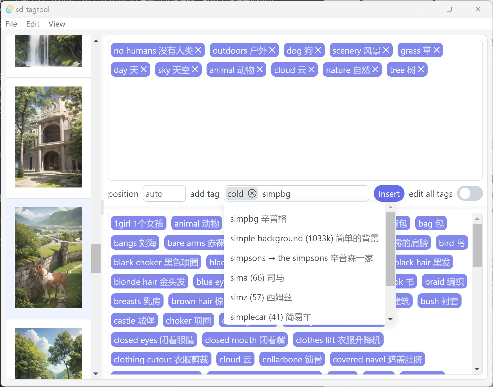

# sd-tagtool

[中文看这里](README-CN.md)

This is a simple tag editor for stable diffusion datasets. It can be used to edit datasets generated by automatic labeling tools. This tool is inspired by [BooruDatasetTagManager](https://github.com/starik222/BooruDatasetTagManager).

### Features

- Support display and management of all image tags
- Support undo/redo
- Intelligent prompt for tag input (support fuzzy matching)
- Support drag and drop for tags
- Tags can be inserted/deleted in batches, and the insertion position can be specified
- Datasets can be filtered by tags
- Customized tag highlighting
- Automatic translation (translation to Chinese is now hard-coded, and may require magic to surf the Internet)
- Quick response

## Screenshot



## Usage

You can try the basic usage by yourself, only a few details are added here.

### Basic tag editing

When you select a picture, drag the tag of the image to sort it, or click the `×` icon on the tag to delete. But the tags cannot be sorted when multiple images are selected.

You can also turn on the *edit all tags* switch, which will delete tags from the entire dataset (all tags are displayed at the bottom of the window). For example, removing "1girl" from all tags will cause the "1girl" tag to be removed from all images.

### Insert tags

Enter a tag in the *add tag* input box and click the *Insert* button to insert a new tag into the selected dataset (you can select multiple images). As you can see *add tag* input box can fill in multiple tags.

The insertion position is specified by the *position* box. These modes are currently supported:
- **auto**: Insert tags to tail if there is no label to be inserted in the image, otherwise do nothing;
- **Positive number**: Insert tags into the position counting from the head, if the tag already exists in the image, it will be moved to the specified position;
- **Negative number**: Similar to positive numbers, but counting from the tail to the front.

The insertion position can exceed the actual number of tags in the image, and the tags will be inserted at the head or tail position at this time.

Double-clicking a tag directly in the list of all labels will also insert it into the tag set of the selected images. The insertion position at this time is also determined by the *position*.

### Undo / Redo

Click *Undo* and *Redo* in the *Edit* menu to undo and redo, and you can also use the shortcut keys to do it.

There is no step limit for undo and redo, but there is currently no reasonable interactive feedback (this will lead to you may not know what happened). Also, the undo history is cleared after opening a new directory.

### Tags filter

Enter the tags to be filtered in the tags filter input at the top, and then click the *Filter* button to filter the dataset. Two filtering modes can be selected via the *exclude* checkbox:
- **Include mode**: when the image has all the tags in the filter, it will be displayed in the filtered list;
- **Exclude mode**: Images that do not have all the tags in the filter will be shown in the filtered list.

After editing the dataset, you need to click the *Filter* button again to update the filtered dataset. You can enter tags manually, or right-click in the tags list and add specific tags to the filter via the *Add filter* menu.

### Tag highlight

You can choose a highlight color for the tag in *Pick color* of the tag's context menu (click the right mouse button), so that you can find it quickly. When you don't need the tag highlighting anymore, you can clear it by *Clear picked color* in the context menu.

## Warning

Remember to save the file before closing sd-tagtool, otherwise all data will be lost! I'm not write confirmation dialog right now. In addition, remember to save the file before opening a new directory or refreshing (the right-click menu has a refresh option, Ctrl + R can also refresh, don't be stupid).

## Development

This project is based on tauri and vue. The build method is as follows:
``` bash
pnpm install
pnpm tauri dev
pnpm tauri build
```

For more specific operations, see [GitHubAction configuration](.github/workflows).
